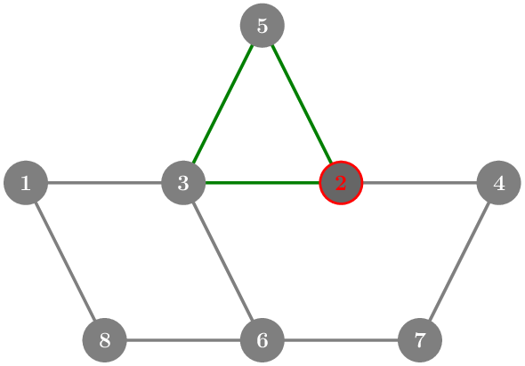

## Shortest Cycle
On the planet Kuklos, cities are connected by roads. We live in one of these cities, and to get some daily exercise, we want to go for a walk. However, to keep things interesting, we do not want to traverse the same road more than once. Our walk must end by returning to our starting city. Since we are feeling tired today, we want to take the shortest possible such walk. Determine the length of the shortest walk and the cities it passes through. If multiple shortest walks exist, any one of them can be given.

### Input
The first line contains three integers: $N$ the number of cities, $M$ the number of roads, $P$ the city where we live. 
Each of the next $M$ lines contains two integers representing a pair of cities connected by a road.

### Output
The first line should contain a single integer: the length $K$ of the shortest cycle that passes through city $P$. If no such cycle exists, print $-1$. 
The second line should contain $K$ distinct city indices in order, forming a length $K$ cycle in the input graph, assuming that the edge from the last city back to the first is included. If multiple valid solutions exist, any of them may be given.

### Constraints
* $1 \le N \le 100000$
* $1 \le M \le 200000$
* $1 \le P \le N$

### Example input
    8 10 2
    1 3
    3 6
    3 2
    2 4
    2 5
    6 7
    6 8
    1 8
    5 3
    4 7

### Example output
    3
    2 5 3

### Explanation of the example
The shortest cycle consists of the roads: 2-5, 5-3 and 3-2.  The cities may be given in any order, as long as it still forms a cycle. For example 5 2 3 is also a valid solution.

