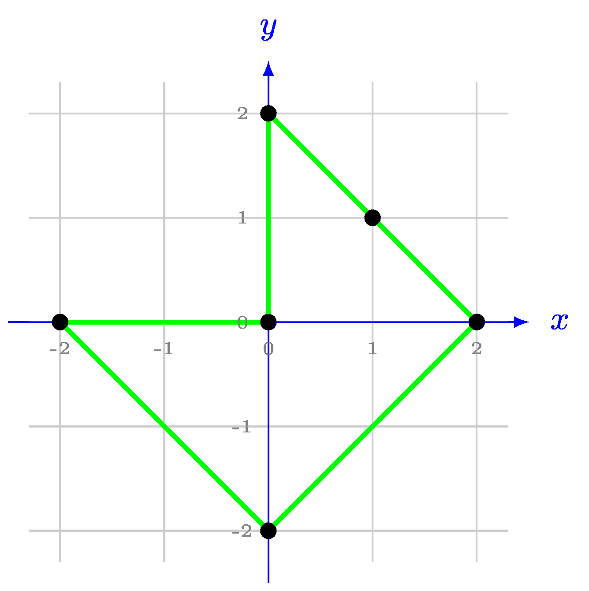

## Closed Polygon
Given $N$ points in the plane, each specified by its $(x,y)$ coordinates. The points are not collinear (this guarantees that a solution exists).

A closed polygon can be described by listing the indices of the points in some order. Consecutive points in the list are connected by straight line segments, and additionally, the last point is connected back to the first one.

Determine an ordering of the points such that:

* every point appears exactly once,
* the resulting closed polygon is simple (i.e., it has no self-intersections; no two non-adjacent edges intersect; adjacent edges share only one point).

### Input
The first line contains the integer $N$, the number of points.

Each of the next $N$ lines contains two integers, the coordinates $(x_i, y_i)$ of a point.

### Output
Print a permutation of the point indices that describes a closed, non-self-intersecting polygon. If multiple solutions exist, you may output any of them.

### Constraints
* $3 \le N \le 1000$
* $-10^8 \le x_i, y_i \le 10^8$ for each $i = 1..N$
* The points are not collinear.

### Example input
    6
    0 0
    2 0
    -2 0
    1 1
    0 2
    0 -2

### Example output
    2 4 5 1 3 6

### Explanation of the example
One possible valid solution is illustrated in the figure below.

