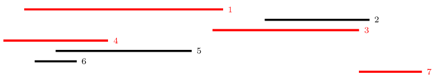

## Legkevesebb pilóta
A Lázadók Szövetsége egy titkos küldetésre készül: el kell juttatni egy adatkazettát a Tatooine-ról a távoli Yavin 4-re, ahol a Lázadók főhadiszállása található. A két bolygó távolsága $K$ fényév.

Számos csempész és pilóta ajánlotta fel segítségét, akik saját hajóikkal szállítanák az adatkazettát. A pilóták azonban csak a saját szektorukban hajlandóak repülni, melykeről ismert, hogy a két bolygó közötti úton a Tatooine-tól számítva hanyadik fényévtől hanyadik fényévig tartanak. Ha egy pilóta az $x$. fényévtől az $y$. fényévig vállal szállítást, akkor bárki átveheti tőle a kazettát, aki a $z$. fényévnél kezdi az útját, ahol $x \le z \le y$.

Írj egy programot, amely kiszámítja, legkevesebb hány pilótára van szükség, hogy az adatkazetta eljusson Yavin 4-re!

### Bemenet
A bemenet első sorában két egész szám van: $K, N$, a Tatooine és a Yavin 4 távolsága, illetve a pilóták száma.

A további $N$ sor mindegyike két egész számot tartalmaz $S_i, E_i$, ($0\le S_i < E_i \le K$), ami azt jelenti, hogy az $i$-edik pilóta az $S_i$-edik fényévtől az $E_i$-edik fényévig vállalja az adatkazetta továbbítását.

### Kimenet
A kimenet első sorába egyetlen számot kell kiírnod, az adatkazetta célba juttatásához **minimálisan szükséges pilóták** számát.

A második sorba szóközzel elválasztva írd ki a pilóták sorszámait, akik teljesítik a feladatot. Ha a felsorolásban az $i$-edik pilótát a $j$-edik pilóta követi, akkor az adatkazettát az $i$-edik pilóta a $j$-edik pilótának adja át.

Több megoldás esetén bármelyik megadható.

Ha az adatkazetta nem juttatható el a célig a pilótákkal, akkor a kimenet első és egyetlen sorába 0-t kell írni!

### Korlátok
* $1 \le N \le 10^5$
* $1 \le K \le 10^9$
* $0 \le S_i < E_i \le K$ minden $i=1 \ldots N$-re

### Példa bemenet
    40 7
    2  21
    25 35
    20 34
    0  10
    5  18
    3  7
    34 40

### Példa kimenet
    4
    4 1 3 7

### A példa magyarázata
Például a **4.** pilóta elviszi a csomagot a Tatooine-tól 8 fényév távolságra. Onnét az **1.** pilóta viszi tovább 12 fényévet, és a Tatooine-tól 20 fényév távolságra átadja a **3.** pilótának, aki a Tatooine-tól 34 fényév távolságra átadja a **7.** pilótának.

Igazolható, hogy **három** pilótával nem oldható meg a feladat.

