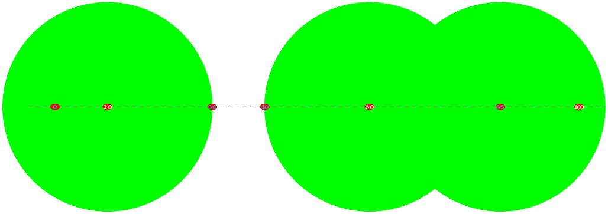

## Védelmi vonal
A Föderáció a Romaulán határon egy egyenes mentén $N$ megfigyelő állomást üzemeltet. A biztonságuk fokozása érdekében új nagy teljesítményű álcázó védőrendszer telepítését határozták el a régiek helyére. Egy új álca-generátor $H$ sugarú lefedettséget biztosít, elrejtve minden állomást a hatósugáron belül a kíváncsi szemek elől (pl. Romaulán Tal Shiar vagy a Klingon Hírszerzés).

Minden régi álca-generátort kidobunk, de nem kell mindegyik helyére újat vennünk, viszont csak valamelyik megfigyelő állomás helyén lehet beépíteni őket.

Például, ha az állomások a $0, 10, 30, 40, 60, 85, 100$ koordinátájú pontokban vannak, és az új generátorok $20$ sugarú körön belül álcáznak mindent, akkor elég hármat telepíteni, például a $10$, $60$ és $100$ állomásoknál. (Csak állomások lehetnek a körök középpontjai, és van több más lehetőség is.)

Készíts egy programot, amely meghatározza a szükséges új álca-generátorok minimális számát és kijelöli, mely pontokra kell ezeket telepíteni, hogy minden megfigyelő állomás az egyik álcázó mező védelmén belül helyezkedjen el.

### Bemenet
A bemenet első sorában két szám van: $N, H$ - a megfigyelő állomások száma és az új álca-generátorok sugara.

A második sorban $N$ szám következik $A_1, A_2, \ldots, A_N$ - a megfigyelő állomások távolságai az elsőtől ($A_i < A_{i+1}$).

### Kimenet
A kimenet első sorába egyetlen számot kell kiírnod $M$-et, a szükséges új álca-generátorok minimális számát.

A második sor pontosan $M$ egész számot tartalmazzon, sorrendben azon megfigyelő állomások sorszámait, ahova új álca-generátort kell telepíteni, hogy minden megfigyelő állomás hatótávolságon belül legyen!

Több megoldás esetén bármelyik megadható.

### Korlátok
* $1 \le N \le 10^5$
* $1 \le H \le 10^9$
* $0 \le A_1 < A_2 < \ldots < A_N \le 10^9$

### Példa bemenet
    7 20
    0 10 30 40 60 85 100

### Példa kimenet
    3
    2 5 7

### A példa magyarázata
Egy lehetséges megoldás a 2., 5. és 7. állomásokat használni. Van másik megoldás is, például lehet használni helyettük az 1., 4. és 6. állomásokat.
