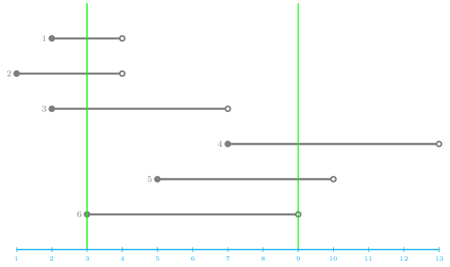

## Sky Spy
The Rebels have successfully hacked one of the Empire's geostationary spy satellites. This satellite orbits directly above the infamous Mos Eisley spaceport, and now the Rebels can take photographs of the docked spaceships without the Empire's knowledge.

Rebel intelligence has obtained information that $N$ spaceships will arrive at different times. Each ship has precisely indicated the time interval during which it will be present at the spaceport. The spy satellite is capable of taking high-resolution photographs, but to avoid detection, we want to take as few photos as possible — while ensuring that each of the $N$ spaceships appears in at least one photograph.

Determine the number of distinct time points when the satellite must be activated to observe the spaceport so that every spaceship is captured at least once while it is actually present.

### Input
The first line of the input contains the number of incoming spaceships: $N$.

Each of the following $N$ lines contains two integers. In the $i$-th line, you are given $A_i$ and $B_i$: $A_i$ is the arrival and $B_i$ is the departure time of the $i$-th spaceship. If a photo is taken at time $T$ and $A_i \le T < B_i$, then the $i$-th spaceship will appear in the photograph.

### Output
The output should contain a single integer: the number of photographs $K$ to be taken.

The second line should contain exactly $K$ integers, separated by spaces, representing the time points (in any order) at which the photographs should be taken.
If there are multiple solutions, any of them is acceptable.

### Constraints
* $1 \le N \le 10^5$
* $1 \le A_i < B_i \le 10^9$ for all $i = 1, 2, \ldots, N$

### Example input
    6
    2 4
    1 4
    2 7
    7 13
    5 10
    3 9

### Example output
    2
    3 9

### Explanation of the example
Ships 3 and 4 cannot be photographed at the same time, so at least two photos are required. The task can be completed with two photos, as shown in the figure. (Multiple correct solutions exist.)

