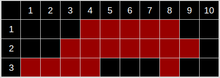

## Űrhajó bérlés
A Mo-Seis-Ley űrkikötőjében a galaxis minden tájáról érkező kalandorok, csempészek és fejvadászok $N$ darab űrhajót bérelhetnek ki. A következő $M$ napra ismertek a bérlési időszakok: melyik űrhajót, hányadik naptól, hányadik napig bérelték ki a látogatók. Írj egy programot, amely meghatározza azt a napot, amikor a legtöbb űrhajót bérelték ki!

### Bemenet
A bemenet első sora az elérhető űrhajók számát ($1 \le N \le 100$), a vizsgált napok számát ($1 \le M \le 1000$) és a bérlések számát tartalmazza ($1 \le K \le 1000$).

A következő $K$ sor a bérlési adatokat tartalmazza: az űrhajó azonosítóját ($1 \le S_i \le N$), valamint az első és utolsó napot ($1 \le A_i \le B_i \le M$), amikor az adott űrhajót kibérelték. Az adatok között nincs ütközés vagy átfedés.

### Kimenet
A kimenet egyetlen sorába annak a napnak a sorszámát kell kiírni, amikor a legtöbb űrhajót bérelték ki (ha több ilyen nap is van, akkor a legkorábbi napot kell választani).

### Korlátok
* $1 \le N \le 100$
* $1 \le M \le 1000$
* $1 \le K \le 1000$
* $1 \le S_i \le N$
* $1 \le A_i \le B_i \le M$

### Példa bemenet
    3 10 5
    1 4 8
    2 3 5
    3 8 8
    2 6 9
    3 1 4

### Példa kimenet
    4

### A példa magyarázata
A negyedik napon három hajót béreltek, a nyolcadik napon is ugyanennyit, de a kettő közül a kisebbet kell kiírni. Az alábbi kép szemlélteti az űrhajók foglaltságát az egyes napokon.

