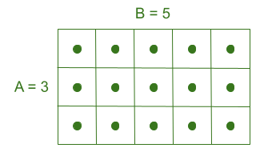

## Kert
A barátomnak, Csitotinak van egy téglalap alakú kertje, amelynek két oldala $A$ és $B$ méter hosszú. Két dolgot szeretne csinálni:
 - Kerítést húz a kert köré. Ehhez olyan hosszú új drótkerítést kell vásárolnia, amennyi a kert négy oldalának teljes hossza.
 - A kert minden 1 m × 1 m méretű négyzetébe ültet egy-egy csirimori fát, ha úgy képzeljük el, hogy a teljes kertet négyzetekre osztjuk (lásd az alábbi képet).

Mekkora a drótkerítés teljes hossza, amelyet meg kell vásárolnia?

Hány csirimori fát tud majd elültetni?

### Bemenet
A bemenet két külön sorban tartalmazza az $A$ és $B$ egész számokat - a kert oldalhosszait.

### Kimenet
A kimenet első sorában írd ki a megvásárolandó kerítés teljes hosszát.
A kimenet második sorában írd ki, hogy hány fát tud ültetni.

### Korlátok
* $1 \le A, B \le 100$

### Példa bemenet
    3
    5

### Példa kimenet
    16
    15

### A példa magyarázata
A kertnek két 3 m hosszú oldala és két 5 m hosszú oldala van, így a kerület $2 \cdot (3 + 5) = 16$.

Az alábbi képen látható módon 15 fát ültethet:

