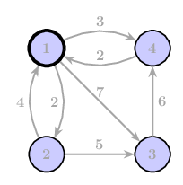

## Central Shortcut
In the Galactic Republic, there are $N$ planets numbered from $1$ to $N$. Planet $1$ is Coruscant, the capital of the Republic and center of political activity. Due to increasing separatist threats, the Republic has instituted new travel regulations for security purposes.

Under these new regulations, travel between planets is restricted to two options:
1. Direct travel between neighboring planets (planets with a direct route between them)
2. Travel via Coruscant (planet $1$) as a central hub

This means that for any two planets that are not directly connected, the only valid path between them must pass through Coruscant, and must not pass through any other planet.

The galaxy's transportation network is represented as a **directed graph**. This means that the distance from planet $A$ to planet $B$ may not be the same as the distance from planet $B$ to planet $A$, or there may be a route in one direction but not the other.

Your task is to calculate the shortest possible path between all pairs of planets under the given travel restrictions.

### Input
The first line of the input contains one integer $N$ ($1 \le N \le 100$) — the total number of planets.

The next $N$ lines each contain $N$ integers. The $j$-th integer in the $i$-th line represents the distance from planet $i$ to planet $j$. If there is no direct route from planet $i$ to planet $j$, the distance is represented as $-1$. The distance from a planet to itself is always $0$.

### Output
Print an $N \times N$ matrix ($N$ rows with $N$ space separated integers in each row), where the value in the $i$-th row and $j$-th column represents the shortest distance from planet $i$ to planet $j$ under the new travel restrictions. If no valid path exists between two planets, output $-1$ for that entry.

### Constraints
* $1 \leq N \leq 100$
* Distances are non-negative integers or $-1$ (indicating no direct route). ($-1 \leq d \leq 10^6$)
* The distance from a planet to itself is always $0$.

### Example input
    4 
    0 2 7 3
    4 0 5 -1
    -1 -1 0 6
    2 -1 -1 0

### Example output
    0 2 7 3
    4 0 5 7
    -1 -1 0 6
    2 4 9 0

### Explanation of the example

The output is an $N \times N$ matrix where each entry $(i, j)$ contains the shortest distance from planet $i$ to planet $j$ using either a direct route or a route through Coruscant (planet $1$).

For example:
- From planet $1$ to planet $3$: Direct route with distance $7$
- From planet $2$ to planet $4$: No direct route exists, so we must go through Coruscant: $2 \to 1 \to 4$ with a total distance of $4 + 3 = 7$
- From planet $3$ to planet $2$: No direct route exists and no path through Coruscant (since planet 3 cannot reach Coruscant directly), so the value is $-1$
- From planet 4 to planet 3: No direct route exists, so we must go through Coruscant: $4 \to 1 \to 3$ with a total distance of $2 + 7 = 9$

