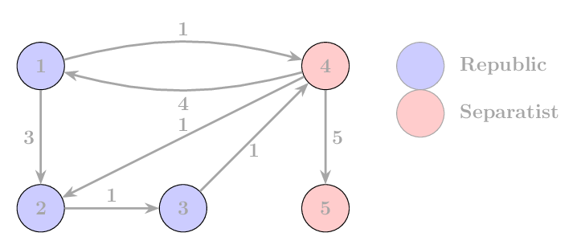

## Republic Starmap

There are $N$ planets in the galaxy, numbered from $1$ to $N$. The first $K$ planets are controlled by the Republic, so these are the Republic planets. The remaining planets do not belong to the Republic.

There are directed routes between the planets. This means there may be a route from planet $A$ to planet $B$ even if there is no route back, or the distances in the two directions may be different.

Your task is to find the length of the shortest path for every pair of planets, under the rule that along the way you may only pass through Republic planets.

More precisely, a path $P_1 \to P_2 \to \dots \to P_q$ is allowed if all intermediate planets, that is $P_2, P_3, \dots, P_{q-1}$, belong to the Republic. The starting planet and the ending planet can be any planets.

### Input
The first line of the input contains two integers $N$ and $K$ ($1 \le K \le N \le 100$). Here $N$ is the number of planets, and $K$ is the number of Republic planets.

The next $N$ lines each contain $N$ integers. The $j$-th number in the $i$-th line is the length of the direct route from planet $i$ to planet $j$. If there is no direct route, this value is $-1$.

### Output
Print an $N \times N$ matrix. The value in row $i$ and column $j$ should be the length of the shortest allowed path from planet $i$ to planet $j$. If there is no such path, print $-1$ in that position.

### Constraints
* $1 \le K \le N \le 100$
* Distances are non-negative integers or $-1$ (indicating no direct route). ($-1 \leq d \leq 10^6$)
* The distance from a planet to itself is always $0$.

### Example input
    5 3
    0 3 -1 1 -1
    -1 0 1 -1 -1
    -1 -1 0 1 -1
    4 1 -1 0 5
    -1 -1 -1 -1 0

### Example output
    0 3 4 1 -1
    -1 0 1 2 -1
    -1 -1 0 1 -1
    4 1 2 0 5
    -1 -1 -1 -1 0

### Explanation of the example

Each value in the output matrix is the length of a shortest allowed path. Here the intermediate planets may only be planets $1$ to $K$, that is, the Republic planets. If there is no such path, the value is $-1$. For example:
- The shortest allowed path from planet $1$ to planet $3$ is $1 \to 2 \to 3$, so the answer is $4$.
- There is no allowed path from planet $2$ to planet $1$, so that value is $-1$.
- There is a direct route from planet $2$ to planet $3$, so that value is $1$.
- The shortest allowed path from planet $4$ to planet $3$ is $4 \to 2 \to 3$, so the answer is $2$.
- There is no allowed path to planet $5$ if we may only pass through Republic planets.