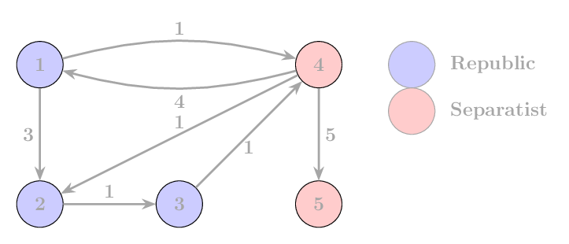

## Köztársasági csillagtérkép

A galaxis két frakcióra osztott: a Köztársaságra és a Szeparatistákra. $N$ bolygó található a galaxisban, amelyeket $1$-től $N$-ig sorszámoznk. A Köztársaság az első $K$ bolygót tartja irányítása alatt (tehát az $1, 2, \ldots K$ sorszámúakat), míg a többit a Szeparatisták uralják ($K+1, K+2, \ldots, N$ sorszámú bolygók). A Köztársaság biztosítani szeretné a hatékony kommunikációt és közlekedést az összes bolygó között (beleértve a szeparatista bolygókat is, mert időnként diplomáciai ügyekben oda kell utazniuk), de csak olyan útvonalakat használhatnak, amelyek kizárólag Köztársaság által irányított bolygókon haladnak át.

A galaxis közlekedési hálózata egy **irányított gráffal** modellezhető, azaz a távolság bolygó $A$ és bolygó $B$ között nem feltétlenül egyenlő a bolygó $B$ és bolygó $A$ közötti távolsággal, vagy előfordulhat, hogy egy irányban van útvonal, de a másik irányban nincs.

A feladatod az, hogy kiszámítsd a legrövidebb utak hosszát az összes bolygó között, kizárólag a Köztársaság által irányított bolygókon keresztül haladva. (Egy $P_1 \to P_2 \to \dots \to P_q$ út megengedett, ha a $P_2, P_3, \dots, P_{q-1}$ bolygók a Köztársaság irányítása alá tartoznak, vagyis $1 \le P_i \le K$, minden $2 \le i \le q-1$ -re.)

### Bemenet
A bemenet első sora két egész számot tartalmaz: $N$ és $K$ ($1 \le K \le N \le 100$) — a bolygók teljes száma és a Köztársaság által irányított bolygók száma.

A következő $N$ sor mindegyike $N$ egész számot tartalmaz. Az $i$-edik sor $j$-edik száma azt jelzi, hogy mekkora a távolság bolygó $i$ és bolygó $j$ között. Ha nincs közvetlen útvonal bolygó $i$ és bolygó $j$ között, akkor a távolság $-1$.

### Kimenet
Írj ki egy $N \times N$ mátrixot, ahol az $i$-edik sor $j$-edik eleme a legrövidebb távolságot jelenti az $i$-edik és $j$-edik bolygó között, kizárólag a Köztársaság által irányított bolygókon át. Ha nincs ilyen útvonal két bolygó között, akkor az adott helyre $-1$-et írj.

### Korlátok
* $1 \le K \le N \le 100$
* A távolságok nemnegatív egész számok vagy $-1$ (ha nincs közvetlen útvonal). ($-1 \leq d \leq 10^6$)
* Egy bolygó önmagától való távolsága mindig $0$.

### Példa bemenet
    5 3
    0 3 -1 1 -1
    -1 0 1 -1 -1
    -1 -1 0 1 -1
    4 1 -1 0 5
    -1 -1 -1 -1 0

### Példa kimenet
    0 3 4 1 -1
    -1 0 1 2 -1
    -1 -1 0 1 -1
    4 1 2 0 5
    -1 -1 -1 -1 0

### A példa magyarázata

A kimenet egy $N \times N$ mátrix. Minden $(i, j)$ pozícióban az $i$-edik bolygóról a $j$-edik bolygóra vezető legrövidebb távolság szerepel, kizárólag a Köztársaság által irányított bolygókon ($1$-től $K$-ig) keresztül haladva. Ha nincs ilyen útvonal, akkor $-1$ szerepel. Például:

* Az $1$-es bolygóról a $3$-as bolygóra vezető legrövidebb út: $1 \to 2 \to 3$, amelynek teljes hossza $4$.  
* Nincs útvonal a $2$-es bolygóról az $1$-es bolygóra, így az adott helyen $-1$ szerepel.  
* A $2$-es bolygóról a $3$-as bolygóra vezető legrövidebb út egy közvetlen útvonal, amelynek hossza $1$.  
* A $4$-es bolygóról a $3$-as bolygóra vezető legrövidebb út Köztársasági bolygókon keresztül halad: $4 \to 2 \to 3$, amelynek teljes hossza $1 + 1 = 2$.  
* Az $5$-ös bolygó nem érhető el Köztársaság által irányított bolygókról, mivel csak a $4$-es bolygón keresztül vezet oda út.  
