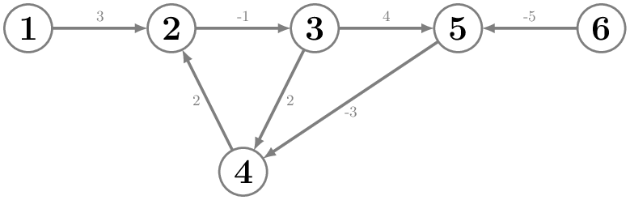

## Route Optimizer
The Millennium Falcon starts from Tatooine and can travel between various planets using specific routes. The planets are numbered from $1$ to $N$, with Tatooine being planet number $1$. Each route has a cost, which comes from fuel usage. Some routes are supported by the Rebel Alliance, so their costs can be negative. For example, there might be a route from Naboo to Kamino with a cost of $5$. It’s possible that the return path is unavailable — or if it exists, it might have a different cost, such as $-2$.

Write a program that computes the minimum total cost to reach each planet from Tatooine using the available routes! The graph of the routes does not contain any directed negative-cost cycles.

### Input
The first line of input contains two integers: $N$ — the number of planets — and $M$ — the number of available routes.

This is followed by $M$ lines. Each line contains three integers: $U_k$, $V_k$, and $W_k$, where $U_k$ is the starting planet, $V_k$ is the destination planet, and $W_k$ is the cost of the $k$-th route ($W_k$ can be negative).

### Output
The program should print $N$ space-separated values. The $j$-th number should indicate the minimum cost to reach planet $j$. If planet $j$ is not reachable from Tatooine, output $X$ instead.

### Constraints
* $2 \le N \le 1000$
* $0 \le M \le 2000$
* $1 \le U_k \ne V_k \le N$ for all $k = 1, 2, \dots, M$
* $-10^6 \le W_k \le 10^6$ for all $k = 1, 2, \dots, M$

### Example input
    6 7
    1 2 3
    2 3 -1
    3 5 4
    3 4 2
    4 2 2
    5 4 -3
    6 5 -5

### Example output
    0 3 2 3 6 X

### Explanation of the example
The graph corresponding to the sample input is:

For example, there are multiple paths to reach planet 4, but the one with the lowest cost is: $1 \to 2 \to 3 \to 5 \to 4$.
