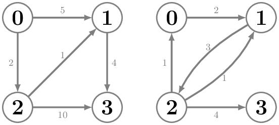

## Fűszerösvények
Vladimir Harkonnen az Arrakis bolygóról felfedezőútra indul az ismert univerzumban. A bolygókat 0-tól $N-1$-ig számozzuk, az Arrakis a 0-ás sorszámú bolygó.

Adott egy irányított gráf, amely a lehetséges bolygóközi utazásokat írja le. Egyes bolygók között csak akkor lehet közvetlenül utazni, ha azt a bemenet tartalmazza. Minden utazás fűszerbe kerül: $S_{i,j}$ egységnyi fűszer szükséges az $i$-es bolygóról a $j$-es bolygóra történő közvetlen utazáshoz.

Írj egy programot, amely az Arrakisról (0-ás bolygó) kiindulva meghatározza, hogy legfeljebb $i$ ($i=1,2,\ldots,N-1$) utazással mennyi fűszerbe kerül eljutni az egyes bolygókra.

Ha egy bolygót nem lehet elérni legfeljebb $i$ lépésben, akkor a program írjon ki $-1$-et arra a helyre.

### Bemenet
A bemenet első sorában két szám van $N, M$, a bolygók száma, és az utazási lehetőségek száma.

Ezt $M$ sor követi, a $k$-adik sor három számot tartalmaz $U_k, V_k, W_k$, ahol $U_k$ az induló bolygó sorszáma, $V_k$ a célállomás sorszáma, $W_k$ útvonal fűszerköltsége (pozitív egész szám).

### Kimenet
A program $N-1$ sort írjon ki, minden sorban $N-1$ szóközzel elválasztott szám legyen. Az $i$-edik sor $j$-edik száma megadja, hogy legfeljebb $i$ utazással mennyi fűszer kell a $j$-edik bolygó eléréséhez. Ha nem lehet elérni így a $j$-edik bolygóra, akkor írj ki $-1$-et.

### Korlátok
* $2 \le N \le 1000$
* $0 \le M \le 2000$
* $0 \le U_k \not= V_k \le N-1$ minden $k=1,2,\ldots,M$ esetén
* $1 \le W_k \le 10^6$ minden $k=1,2,\ldots,M$ esetén

### 1. Példa bemenet
    4 5
    0 1 5
    0 2 2
    2 3 10
    2 1 1
    1 3 4

### 1. Példa kimenet
    5 2 -1
    3 2 9
    3 2 7

### Az 1. példa magyarázata
Az első példa a bal oldalon, a második a jobb oldalon látható:

1 lépésben csak az 1. és a 2. bolygóra lehet eljutni, 5 illetve 2 fűszerért.
2 lépésben az 1. bolygóra már 3 fűszerért is el lehet jutni, és a 3. bolygóra 9-ért.
3 lépésben a 2. bolygóra már 7 fűszerért is el lehet jutni.

### 2. Példa bemenet
    4 5
    0 1 2
    2 0 1
    1 2 3
    2 1 1
    2 3 4

### 2. Példa kimenet
    2 -1 -1
    2 5 -1
    2 5 9
